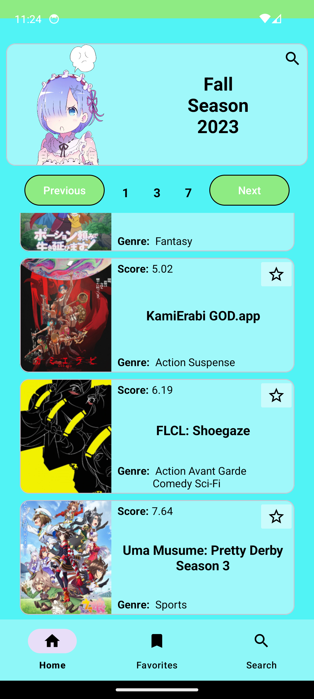
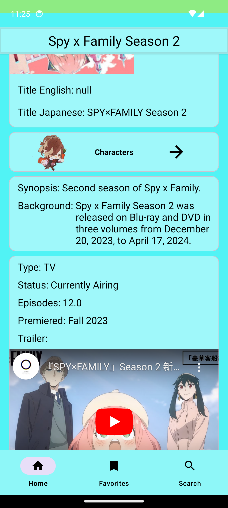
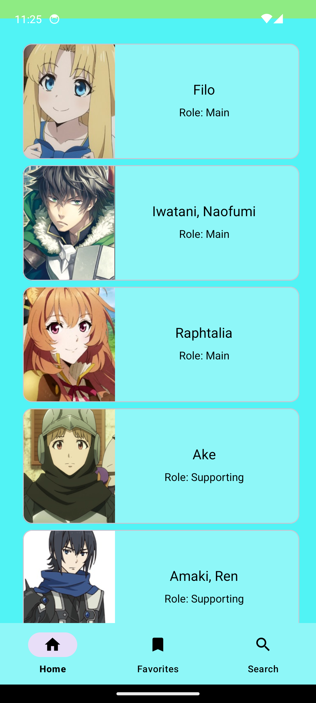
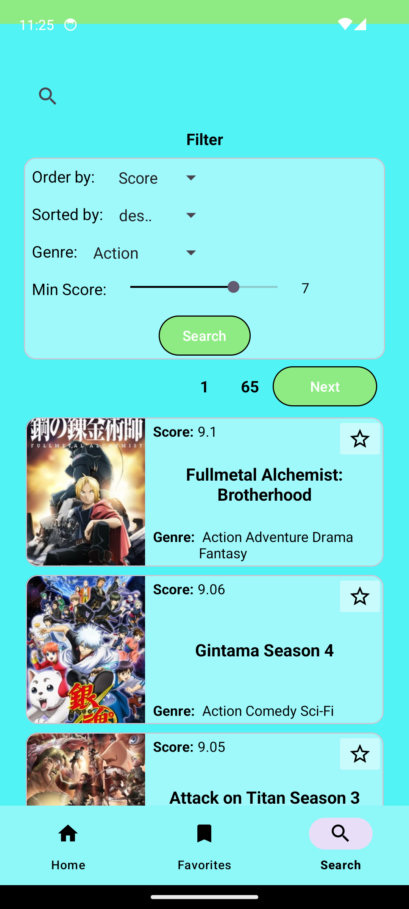
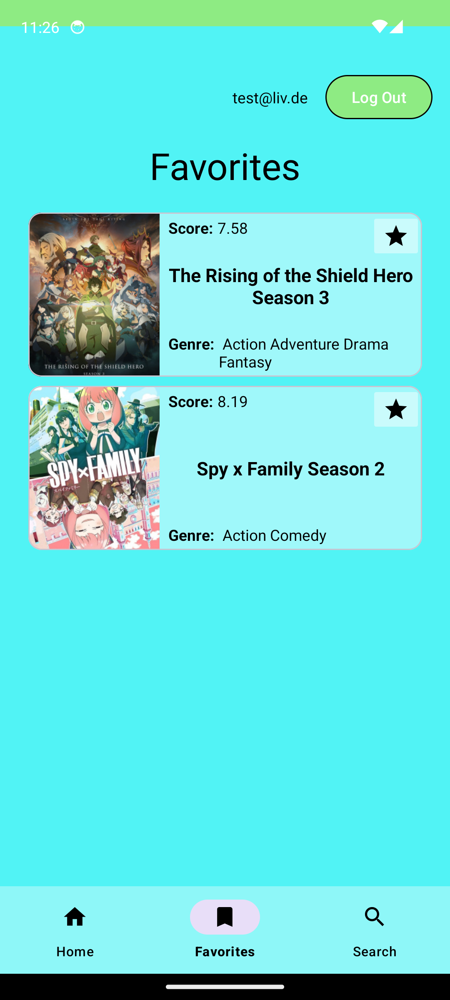

# AniMe

Keep track of current and past anime and add your favorites to a list. You will also find information about the animes and their characters.
This is a training project for Syntax Institute, it is not intended to publish the app.

## Features

*Animes of the current and old seasons

*Information on genre, number of episodes, first broadcast and characters and their voice actors

*Create a list of your favorite anime

## Features that are still missing

*Detailed view of the voice actors 

*Character and Manga Search 

*More filter options
