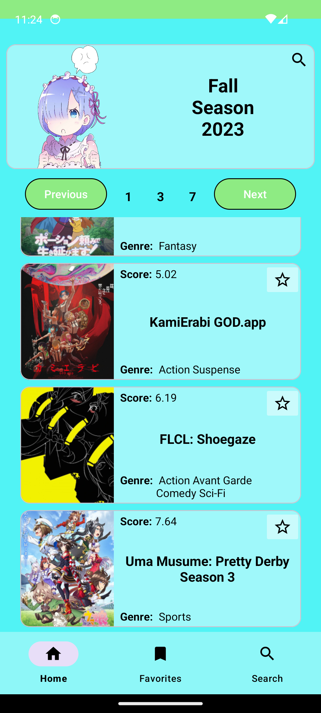
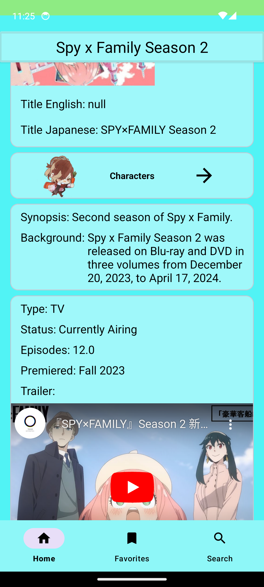
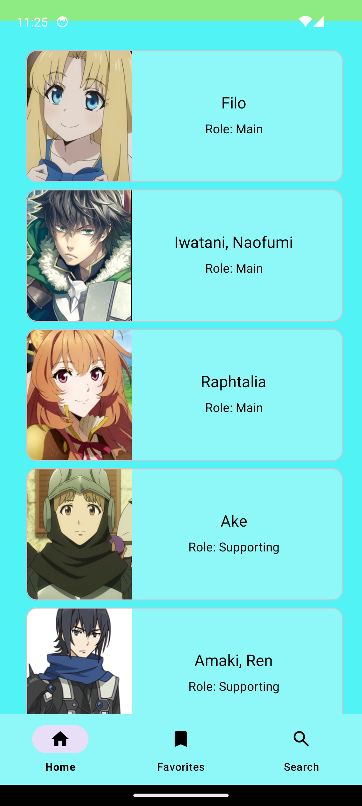
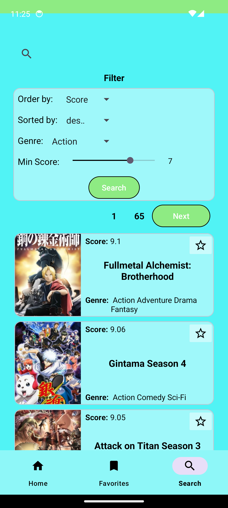
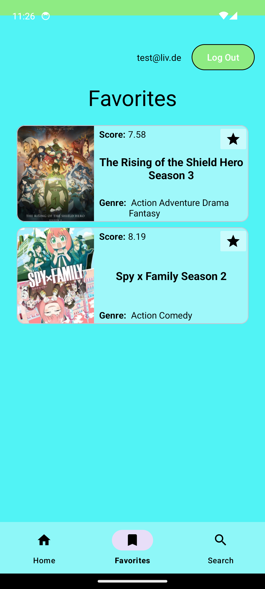

# AniApp — Android & iOS

The shared Flutter app is in [`mobile/`](mobile/). Version 0.3.5 adds a redesigned login/registration flow with password recovery, AniNews previews and broader verified ADN episode coverage. Existing live catalog, Kitsu details, watchlists, language observations and source-aware calendar work on Android and iOS. See the [current source coverage and release gates](docs/RELEASE_READINESS.md); provider coverage, production email and store release setup are not yet complete.

The original Kotlin application below remains as a historical training reference.

# AniMe

Keep track of current and past anime and add your favorites to a list. You will also find information about the animes and their characters.
This is a training project for Syntax Institute, it is not intended to publish the app.

## Features

*Animes of the current and old seasons

*Information on genre, number of episodes, first broadcast and characters and their voice actors

*Create a list of your favorite anime

## Features that are still missing

*Detailed view of the voice actors 

*Character and Manga Search 

*More filter options

Live content (0.2.4): hourly free RSS/API news from Anime2You and MyAnimeList/Tenrai, an automatically refreshed Japanese broadcast calendar, and dated provider-verified language observations. All displayed production content comes from real sources. See [implementation details and coverage](docs/IMPLEMENTATION.md).
